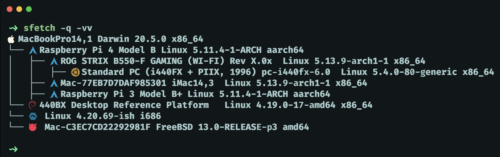

# sfetch
CLI application to display system information for all hosts accessible over ssh. Hosts are grouped in a tree based on the `ProxyJump` attribute in `ssh_config`. A terminal with support for [nerdfonts](https://www.nerdfonts.com/font-downloads) is required to render OS icons. See `sfetch --help` for configuration options.



## Installation
Clone the project
```bash
git clone git@github.com:Kafva/sfetch.git
```
and run `./scripts/build-release.sh` to install the binary in `$GOPATH/bin`. On Windows, it is necessary to first install golang through `scoop` and then run `./scripts/build-release.sh` inside WSL.

## Notes
* To explicitly skip a specific host in your `ssh_config`, e.g. `github.com`, an `.ignore` file can be provided via the `-i` option.
* Motherboard information is only available for BSD hosts if `doas` and `dmidecode` are installed.
* The program relies on shell scripts (`./scripts/info.sh` etc.) to determine system information. In the release build these scripts are embedded inside the source code as string literals to make the binary more portable. 
* Using
```bash
go run main.go
```
will read the scripts directly from disk instead, which is preferable during development.
